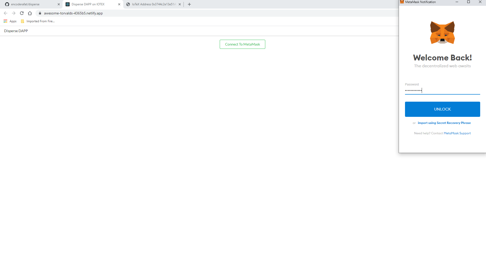
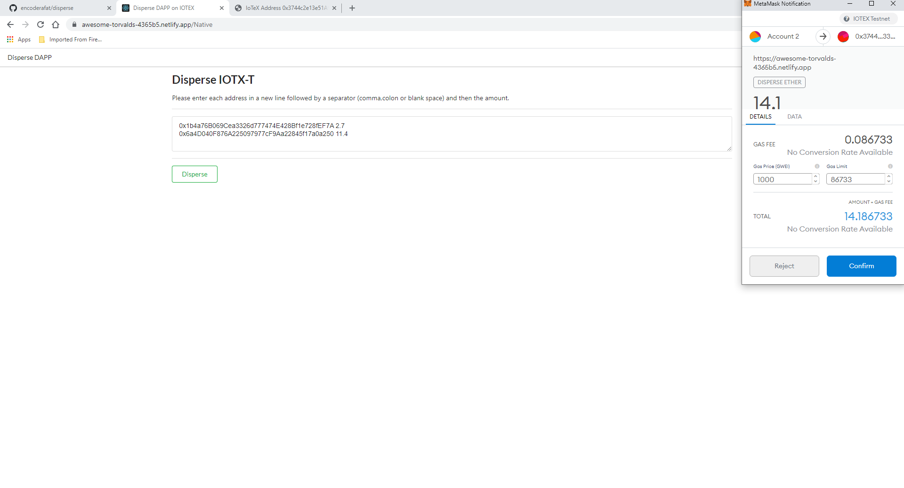
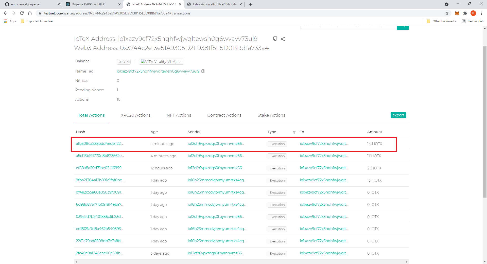
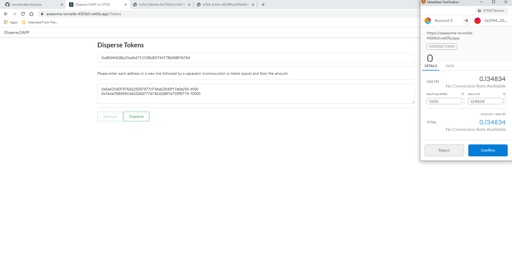
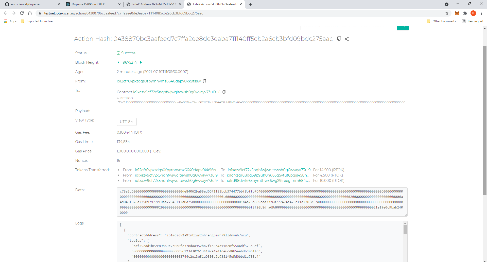

# Disperse DAPP

Disperse DAPP is a batching protocol for both native currency and ERC20/XRC20 tokens that can help reduce gas cost for multiple transfers by batching them in a single block.

DAPP is live at https://awesome-torvalds-4365b5.netlify.app/

Contract Address : ```0x3744c2e13e51A9305D2E9381f5E5D0BBd1a733a4``` [on IOTEX Testnet](https://testnet.iotexscan.io/address/0x3744c2e13e51A9305D2E9381f5E5D0BBd1a733a4)

## Installation and Tests

### Backend (Truffle)

Use .secret file to store mnemonic or make suitable changes to truffle-config.js

```npm install truffle-hdwallet-provider @openzeppelin/contracts@2.5.0 ``` To install dependencies

```truffle test``` to run tests. (You may have to install ganache-cli)

You should get a screen [similar to this](https://github.com/encoderafat/disperse/blob/main/truffletests.png) if the tests are successful.

```truffle migrate --reset --network testnet``` to migrate to the iotex testnet.


### Frontend (create-react-app)

``` yarn install ```

``` yarn start ```


### Documentation

This DAPP is based entirely on Artem K's [disperse app on ethereum. (PDF Link)](https://disperse.app/disperse.pdf)

My contract is compatible with solidity 0.5.x and is available [here.](https://github.com/encoderafat/disperse/blob/main/truffle/contracts/disperse.sol)

To batch together native currency.

```function disperseEther(address payable[] calldata recipients, uint256[] calldata values) external payable ```

recipients is an array of addresses and the values is the array of amount that is being send to each of the addresses respectively.

To batch together ERC20/XRC20 tokens.

```function disperseToken(address tokenAddress, address payable[] calldata recipients, uint256[] calldata values) external```

tokenAddress is the contract address of the ERC20 contract. The other values are same as above.

There is also a simplified and unoptimized version of disperseToken that we won't be using for our dapp.

```function disperseTokenSimple(address tokenAddress, address payable[] calldata recipients, uint256[] calldata values) external```

### Usage

Please click on images to enlarge.

1. Metamask wallet is required. 



2. Home Page of the App is loaded once metamask is connected and you shift to IOTEX testnet.


3. Transfer Currency (IOTX-T) from the user account to two other accounts.



4. View the transaction on iotexscan.io 



[Disperse Contract on IOTEXSCAN.IO](https://testnet.iotexscan.io/address/0x3744c2e13e51A9305D2E9381f5E5D0BBd1a733a4)

5. Token dispersal is a two part process as you have to approve the contract to spend your tokens on your behalf. For this demo I deployed a token on the IOTEX testnet with the contract address [0xdE84062Ba55ed6671153BcB374477Bbf8BFfb764]


6. Disperse tokens.



7. View the Transaction on iotexscan.io



[Transaction on IOTEXSCAN.IO](https://testnet.iotexscan.io/action/0438870bc3aafeed7c7ffa2ee8de3eaba711140ff5cb2a6cb3bfd09bdc275aac)

